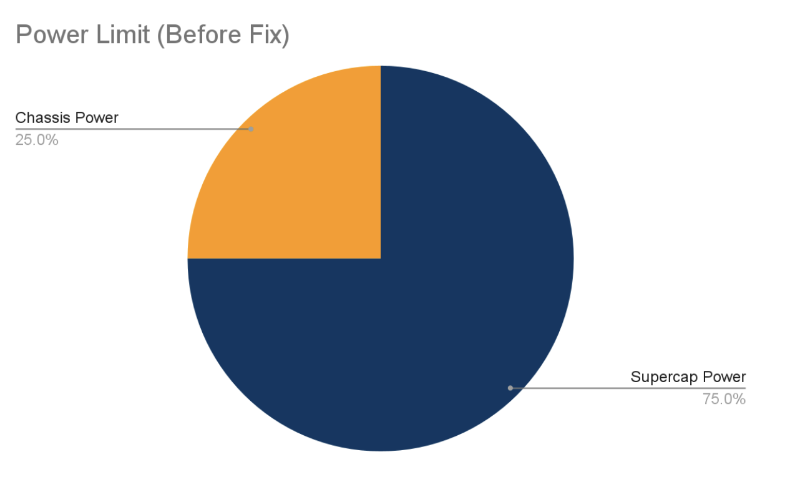
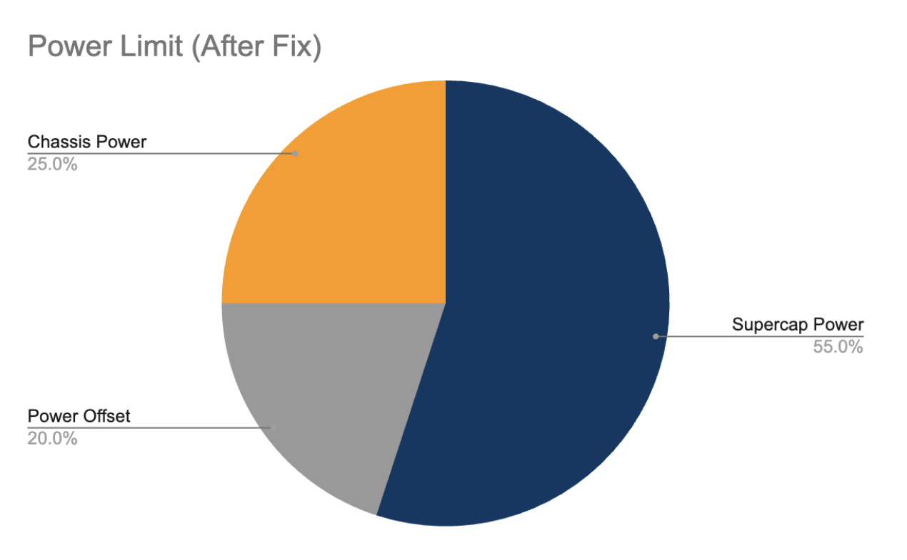
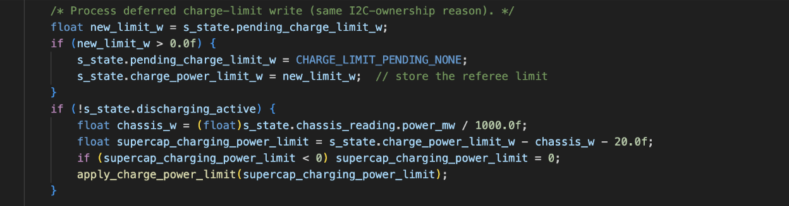
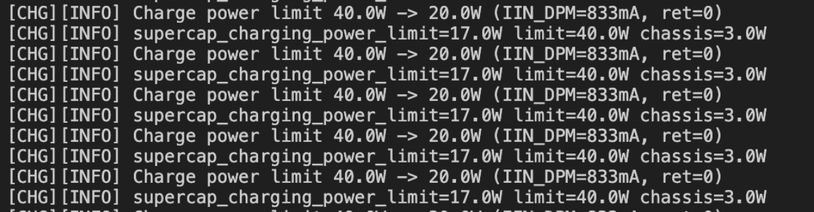

# **Chassis Power Limiting with Supercap**

The chassis power limit is 75W for Standard and 100W Hero/Sentry. If we go over this chassis power limit, PMM will cut off chassis power. The PMM Chassis goes straight to the Supercap Control Board, which feeds power to both the Supercap Array and the Chassis power. 

To make sure the power consumption from both the Supercap and Chassis don’t go over the power limit, the Supercap consumes (power limit) \- (Chassis power consumption) amount of power. However, this approach has two issues: 

1. The power feedback happens once every 100 ms. So if a power spike occurs in this duration, the power limiting algorithms in Supercap and Chassis would become unreliable, which could cause the power consumption to exceed the power limit.   
2. Because the Supercap consumes all power that the Chassis is not using, the Chassis’s power limiting algorithm would hinder more power from being drawn to speed up. In other words, the robot may sacrifice speed in exchange for charging the Supercap, while speed should be prioritized over charging. 

       

To fix both issues, a power offset was added. This power offset is subtracted from the Chasis power consumption, which means that: 

1. Power spike is much less likely to cause the power consumption to exceed the power limit.   
2. The Chassis Power will always have extra power to draw, prioritizing allowing the robot to speed up. 

       

This offset power is implemented under the Supercap\_App\_Task in supercap\_app.c, Controls\_Supercap\_Controller repository. 

  

Test Result:

  

As you can see, the 20.0W is being subtracted from the original Supercap power limit of 40.0W \- 3.0W, producing the new 17.0W Supercap charging power limit. 