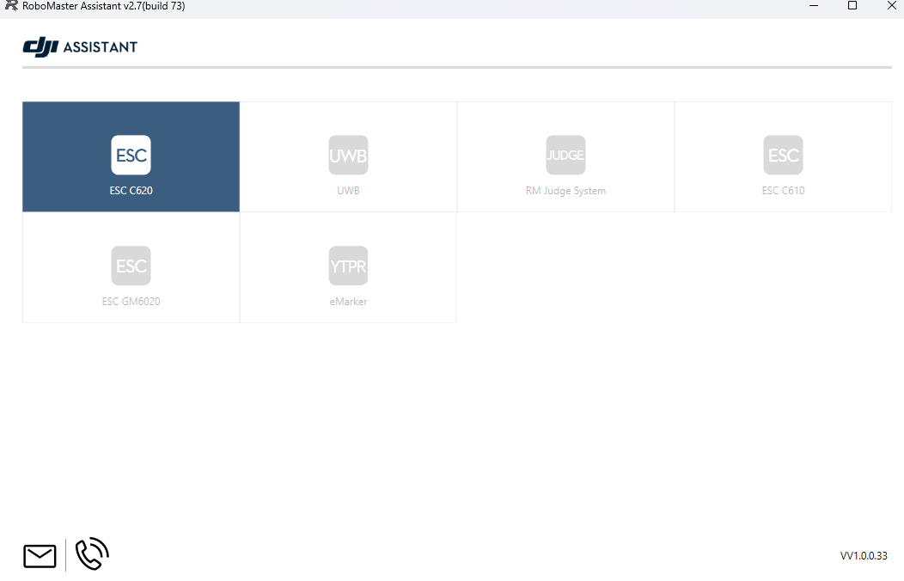
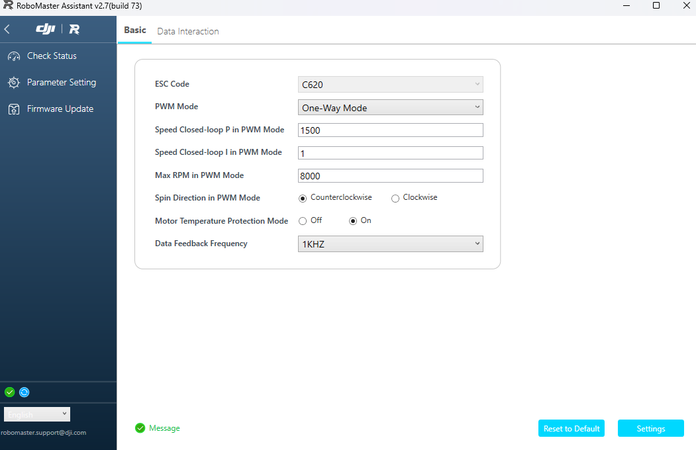

# Referee System Guide

This guide explains how to use various RoboMaster software. Note that RoboMaster software is only compatible with Windows. If you have a Mac, use the Toughbook in the GameLab with the RoboMaster software pre-installed.

If you want to test a robot in a competition environment, you must run both the player client and server.

## Player Client
RoboMaster provides a player client, which will act as our game client during a match. It can display what our robot sees and send commands using a connected video transmitter module (VTM). To run it:
1. Download and extract the client [here](https://bbs.robomaster.com/wiki/20204847/804785?source=7) if you haven't already. If you don't see the download button, scroll right on the downloads table. As of February 2026, the relevant clients are:
    - 3V3 Match: RoboMasterClient 12.0.0.30_3v3_Student
    - 1V1 Match: RoboMasterClient 12.0.0.30_1v1_Student
2. Open the folder you extracted and double-click `start.bat`
3. (Optional) Change the language using the dropdown at the top-right 
4. Click the "Client" button at the bottom
5. Your player client should now be running. You can open the setting menu by pressing P. TODO

## Server
RoboMaster provides server software we can run to simulate a match and manipulate the game state.
1. Download and extract the server [here](https://bbs.robomaster.com/wiki/20204847/804785?source=7) if you haven't already. If you don't see the download button, scroll right on the downloads table. As of February 2026, the relevant servers are:
    - 3V3 Match: RoboMasterEngine 12.0.0.34_3v3_Student
    - 1V1 Match: RoboMasterEngine 12.0.0.29_1v1_Student
2. Open the server folder you extracted and double-click `RoboMasterEngine.exe`
3. TODO

## Tools
RoboMaster provides a Tools program to configure and update referee components. To run it:
1. Download and extract Tools from [here](https://bbs.robomaster.com/wiki/20204847/811111?source=7) if you haven't already. If you don't see the download button, scroll right on the downloads table.
2. If you don't have a robot, wire the following together:
    - Power Management Module (PMM) to Battery using XT60 port
    - PMM to Main Control Module (MCM) using aviation cable port labeled "Main Control"
    - PMM to other referee components you want to configure using any other aviation cable port
    - MCM to your laptop using micro USB cable
3. Turn on your robot or circuit battery.
4. Open the folder you extracted and double-click `RoboMaster Tool 2.exe`
5. At the bottom left, click the dropdown, select the COM port the MCM is connected to on your laptop, and click the submit connect button next to the dropdown.
6. Click the tabs on the left sidebar

## Assistant
RoboMaster provides an Assistant program to configure motor speed controllers (C620, GM6020). To run it:
1. Download and extract Assistant from [here](https://bbs.robomaster.com/wiki/20204847/810714?source=7) if you haven't already. If you don't see the download button, scroll right on the downloads table. 
2. If you don't have a robot, wire the following together:
    - Power Management Module (PMM) to Battery using XT60 port
    - PMM to speed controller you want to configure using XT30 port labeled mini-PC
    - Speed Controller to laptop using 3-pin JST to jumper wires to USB-to-TTL adapter. Connect GND to GND, RX to TX, and TX to RX.
3. Turn on your robot or circuit battery.
4. Open the folder you extracted and double-click `RoboMaster Assistant.exe`. You should see the following, except with your speed controller type highlighted. If you don't try restarting your speed controller and re-check your wiring. 
5. Click your speed controller type. At the bottom-left, you can select your language in the dropdown.
6. If you want to change speed controller settings, click "Parameter Setting" in the left sidebar. Some settings you can change include:
   - Motor Direction (PWM Mode)
   - Motor PID (PWM Mode)
   - Feedback Rate (CAN Mode)

7. Save your settings by clicking "Settings" at the bottom right. It is a mistranslation of "Save".
8. If you want to configure another speed controller, wire the 3-pin JST to the speed controller and restart the Assistant software to ensure you are communicating with the new speed controller.