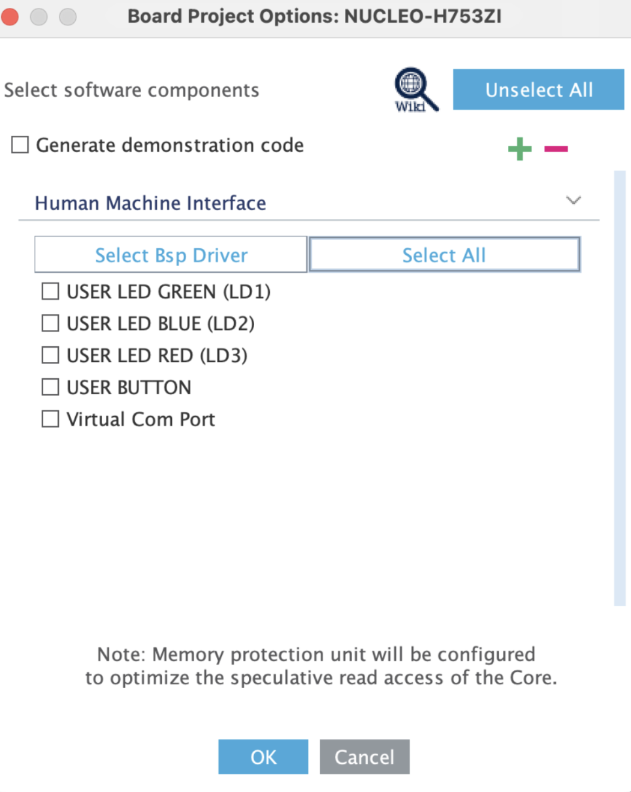
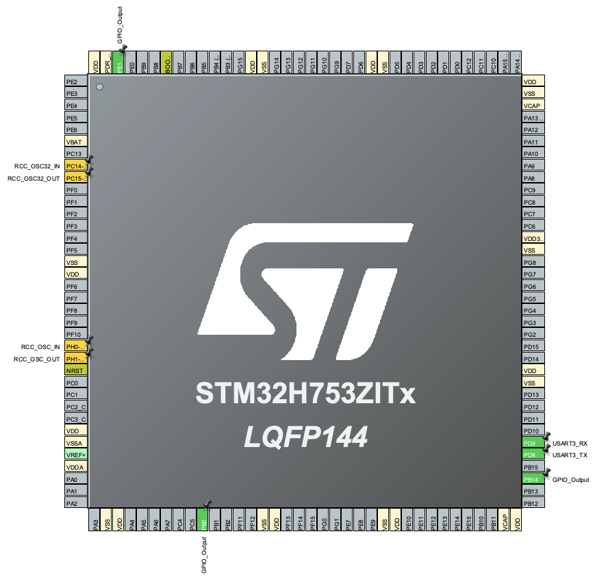
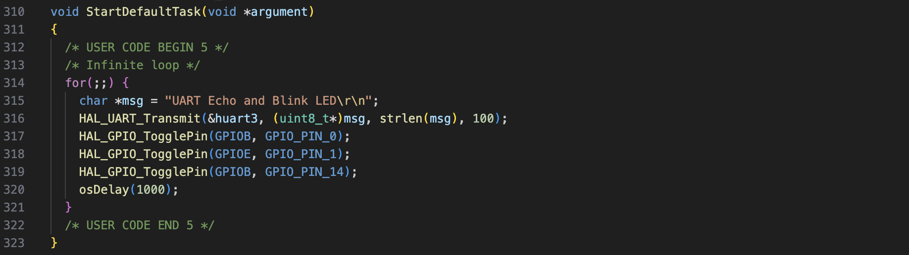
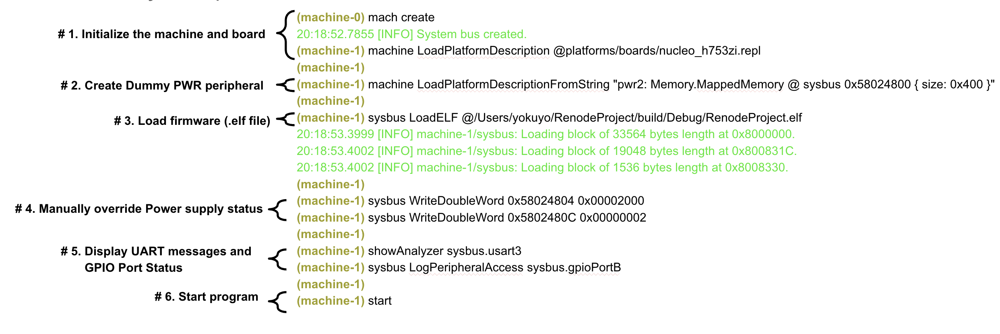
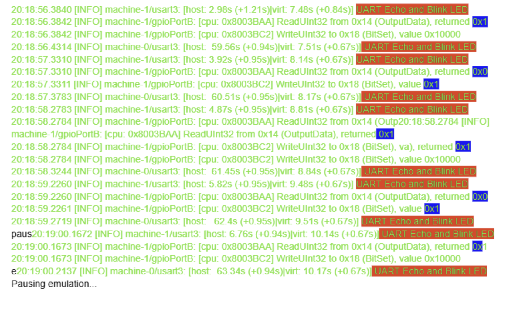

# **Renode Nucleo Board Experiment**

This document summarizes an experiment conducted with Renode to simulate a nucleo\_h753zi board to print messages over UART, observe GPIO state changes, and resolve PWR hang. 

Renode is an open-source embedded systems simulator that can run firmware .elf files on a virtual MCU. Renode could be useful in catching bugs before flashing code onto real hardware. Renode can be downloaded from [here](https://github.com/renode/renode/releases). 

## Peripherals tested in this experiment:

- UART  
- GPIO  
- PWR

## Setup:

## **Create the CubeMX Project** 

1. Open STM32CubeMX and click **New Project**.  
2. Go to the **Board Selector** tab (not MCU Selector). Search for **NUCLEO-H753ZI** and select it. Click **Start Project**.   
   1. When it asks to initialize peripherals, click **Unselect All**. Otherwise, USART3, which would be required later, would not be configurable.   
        
        
        
3. Enable **FreeRTOS** under Middleware  select CMSIS\_V2 interface.  
4. Under **SYS**, change **Timebase Source** from SysTick to a timer (e.g. TIM6)  FreeRTOS needs SysTick for itself.  
5. Under **USART3**, confirm it's enabled in Asynchronous mode. The Nucleo routes USART3 through ST-Link as a virtual COM port.  
6. Under **GPIO**, manually set LED pins are set as GPIO Outputs  
   1. LD1 green is PB0, LD2 yellow is PE1, LD3 red is PB14  
   2. At this point, the pinout view should look like the following:  
        
        
        
7. In **Project Manager**, set your project name, toolchain to **CMake**, and generate the project.

## **Create a simple project with UART, GPIO, and FreeRTOS**

- Created a task that outputs a message over UART using HAL\_UART\_Transmit and blinks all three LEDs. 

- Build to generate an .elf file. 

## Testing:

After opening Renode, copy and paste the following commands:

PWR Hang 

- As step \#2 in the image above shows, I manually created a “dummy” PWR peripheral. This process is necessary because otherwise, Renode would continuously print the following error message: 

“ 19:44:28.6925 \[WARNING\] sysbus: \[cpu: 0x80004C0\] (tag: 'PWR') ReadDoubleWord from non existing peripheral at 0x58024804, returning 0x00000000. (10000) ”  
	

- This error message is repeatedly printed and prevents any other messages from being printed because Renode is unable to detect a PWR peripheral in a virtual environment. To work around this, the command shown in \#2 of the image above was used to create a dummy PWR peripheral, and the commands in \#4 were used to override the power supply status of the dummy PWR peripheral.   
- Every time Renode is booted, this process is necessary to prevent the PWR Hang. In other words, Renode is able to accurately detect that a PWR peripheral is missing.   
- In the future, other peripherals could cause Hangs. To check which peripherals are missing and the state of each peripheral, the command “peripherals” could be used to print all information regarding peripherals. 

UART and GPIO

- The first command in step \#5, “showAnalyzer sysbus.usart3” was used to print the UART message “UART Echo and Blink LED.” Usually, the command “showAnalyzer sysbus.usart3” is expected to pop up a new terminal window and print UART messages there. However, on my computer, no new terminal windows were opened, and UART messages were printed on the same terminal window as Renode.   
- The second command in step \#5 “LogPeripheralAccess sysbus.gpioPortB” was used to log and show the GPIO port status of PB0 and PB14, which are in charge of the green and red LEDs. Though not shown on the image, the command “LogPeripheralAccess sysbus.gpioPortE” was later used to also display the GPIO port status of PE1, the yellow LED.   
- After starting the program, the following was printed on the Renode terminal window:   
    
  

- As shown, both the UART message and the GPIO port status were successfully displayed. 

## In the future

- To use Renode to simulate other boards, a custom .repl (Renode PLatform) file may need to be written.  
- .repl file is responsible for memory mapping, which means that it tells the CPU which memory address is responsible for what peripheral. In this experiment, a nucleo\_h753zi board was used via the command “machine LoadPlatformDescription @platforms/boards/stm32h753zi\_nucleo.repl”, so no .repl file had to be written; Renode has a built-in library of "Pre-made Blueprints" for the most popular development boards, which includes nucleo\_h753zi. However, if a custom board is to be used with Renode, a custom .repl file needs to be created and loaded.   
- Furthermore, instead of typing each command manually, a script file (.resc) could be created to automate some processes, such as creating the machine, loading .repl file, loading .elf file, etc.   
- To simulate the physical behavior of the board or work around certain hangs, the process of “Mocking” may be necessary. Mocking involves creating "fake" hardware blocks or registers in memory to prevent the CPU from crashing when it attempts to access peripherals that haven't been fully simulated. Mocking is realized by creating memory spaces in the .repl file.   
- “Hooks” then make the memory spaces created in .repl file act in certain ways. Hooks are usually lines of Python code written in the script file that simulate hardware behaviors. For instance, a “fake” sensor value could be returned to test how your program would react. 

- One way Renode can be powerful is its ability to merge with Gitlab and become part of the CI/CD pipeline. CI/CD (Continuous Integration/Continuous Deployment) is an automated software development practice where code changes are frequently integrated, built, tested, and deployed through an automated pipeline. Currently, we only check whether a program “builds” before being merged into each repository’s main branch. By leveraging Renode’s ability to work with Gitlab, we will be able to automate other tests, such as “after certain code changes, will the behavior of ABC still be XYZ?”  
- This could be done by   
1. Create a Robot Framework test script (.robot file) that tells GitLab what a successful test looks like  
2. Prepare the Renode Script .resc file  
3. Create a .gitlab-ci.yml file that instructs a GitLab Runner to use a Renode-equipped Docker image to build the firmware and execute the .robot file for automated validation