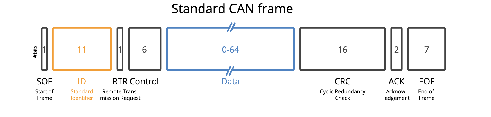

# CAN explanation

## What is CAN

CAN bus(Controller Area Network System) that connectes all our electrical components together. CAN was created for the simple purpose that any two electrical componenet will have the capability to be able to send and recieve commands withou a actual processing unit.

A CAN wire is composed of two wires, CAN low and CAN high


<p align="center"><sub><strong>Figure 1</strong>: can wire</sub></p>

the can wire that we use for robomasters is specifically 1.25-mm pitch 2-pin GHR wire (this is for when you guys inevitably have to buy more)

## CAN Frame

Since the can wire is just two wires and have to ensure that all electrical components can communicate between each other, the CAN Frame(which is what the CAN message is sent to each other is called) is very complicated 

Below is a picture of what it is composed of.



<p align="center"><sub><strong>Figure 2</strong>: can frame</sub></p>

* **SOF**: the start of the frame, tells the other units that a CAN message is coming
* **CAN ID**: Identifies the message, allows certain units to ignore it if it only reads certain CAN ID messages.
* **RTR**: whether or not a unit is sending or requesting data
* **CONTROL**: the length of the data
* **DATA**: Contains the actual data values
* **CRC**: ensures whether or not the data is corrupted after sendign it
* **ACK**: whether or not your unit has received the data correctly
* **EOF**: end of frame, signifying your CAN frame ended

In our case, you only really need to worry about how CAN ID and the DATA part of the data frame works. 

## CAN ID

In terms of robomasters, there are 8 different Motor IDs from 1-8 that translates to CAN IDs. There are two different forms of CAN IDs here, one for feedback(motor sending data back to board) and one for control. However, depending on the motor, the feedback identifier for the CAN ID will be different.

### GM6020

For GM6020, the CAN ID for motor feedback starts at 0x205 up to 0x20B (x in this case signifies that it is a hex number) with a control identifier of 0x1FF for IDs 1-4 or 0x205 to 0x208 and 0x2FF for 0x209 - 0x20B

lets first talk about sending can


<p align="center"><sub><strong>Figure 3</strong>: sending can</sub></p>

based on the photo, you can see that each can frame can control up to 4 motors. Since our current message is from -25000 - 25000, it does not fit within 8 bits/1byte as the largest number 1 byte could be is -128 to 127 for signed numbers (click [**here**](https://cspages.ucalgary.ca/~mgavrilo/215/Signed_Numbers.html#:~:text=The%20rule%20for%20signed%20and,1%20for%20a%20Negative%20number.) for explanation of what a signed number) either way, it does not fit within just one data field.

In order to fix this, our data number is split into two in stored in two data fields where they will later be conbined and used to represent the actual voltage value.

Here is how we do it within the code

```C
HAL_StatusTypeDef CAN_Manager_SendGM6020Current(CAN_HandleTypeDef *hcan, uint8_t motor_id, int16_t current)
{
    if (hcan == NULL) return HAL_ERROR;
    //if wrong motor id is given put a error
    if (motor_id < 1 || motor_id > 7) return HAL_ERROR;

    //Clamps the current so if it goes over the max it can only give max input
    if (current >  25000) current =  25000;
    if (current < -25000) current = -25000;

    //sets the id of the motor tepending on whether or not it is 1-4 or 5-7
    uint16_t stdId = (motor_id <= 4) ? 0x1FF : 0x2FF;
    
    //determines which data slot it is supposed to be 
    uint8_t  slot  = (motor_id <= 4) ? (uint8_t)(motor_id - 1) : (uint8_t)(motor_id - 5);


    CAN_TxHeaderTypeDef tx = (CAN_TxHeaderTypeDef){0};
    //the DATA field
    uint8_t d[8] = {0};
    uint32_t mb;

    //sets StdId, IDE, RTR, DLC respectively
    tx.StdId = stdId;
    tx.IDE   = CAN_ID_STD;
    tx.RTR   = CAN_RTR_DATA;
    tx.DLC   = 8;

    //splits the current value into two to put into the data list
    d[slot*2 + 0] = (uint8_t)((current >> 8) & 0xFF);
    d[slot*2 + 1] = (uint8_t)( current       & 0xFF);

    //sends the CAN message
    HAL_StatusTypeDef st = HAL_CAN_AddTxMessage(hcan, &tx, d, &mb);
    extern CAN_Manager_t can1_manager; extern CAN_Manager_t can2_manager;
    CAN_Manager_t *m = NULL;
    if (hcan == can1_manager.hcan) m = &can1_manager; else if (hcan == can2_manager.hcan) m = &can2_manager;
    if (m) {
        if (st == HAL_OK) m->tx_ok++; else m->tx_err++;
        m->last_tx_time = HAL_GetTick();
    }
    return st;
}
```

Next is receiving CAN


<p align="center"><sub><strong>Figure 4</strong>: receive can</sub></p>

This is the same as sending can, except the data fields just means something different, the identifiers are from 0x204 plus the motor id. From the motor, you can get the angle, speed, torque current, and motor temp.

below is the code that we use to read the feedback

```c
// Gimbal pitch/yaw GM6020 feedback (allow on CAN1 and CAN2)
    if (rx.IDE==CAN_ID_STD && rx.DLC==8 && rx.StdId>=0x205 && rx.StdId<=0x20B) {
        uint8_t gid = (uint8_t)(rx.StdId - 0x204);
        if (gid >= 1 && gid <= 7) {
            uint16_t angle_raw = (uint16_t)((d[0]<<8) | d[1]);
            int16_t  speed_rpm = (int16_t)((d[2]<<8) | d[3]);
            pitch_on_feedback(gid, angle_raw, speed_rpm);
        }
    }
```


### M3508 motor with C620 motor speed controller

the m3508 motor has no speed controller integrated within the motor itself, there for, it has a c620 speed controller.

For sending CAN, for ids 1-4/0x201-0x204, the sending CAN ID is 0x200, and for ids 5-8/0x205-0x208, the sending CAN ID is 0x1FF.


<p align="center"><sub><strong>Figure 5</strong>: send can 1</sub></p>


<p align="center"><sub><strong>Figure 5</strong>: send can 2</sub></p>

```c
HAL_StatusTypeDef CAN_Manager_SendMotorCurrents4(CAN_HandleTypeDef *hcan, uint16_t std_id,
                                                int16_t i1, int16_t i2, int16_t i3, int16_t i4)
{
    if (hcan == NULL) return HAL_ERROR;
    CAN_TxHeaderTypeDef tx = (CAN_TxHeaderTypeDef){0};
    uint8_t d[8];
    uint32_t mb;

    tx.StdId = std_id;
    tx.IDE   = CAN_ID_STD;
    tx.RTR   = CAN_RTR_DATA;
    tx.DLC   = 8;

    //sends values for currents for four different motors
    d[0] = (uint8_t)(i1 >> 8); d[1] = (uint8_t)i1;
    d[2] = (uint8_t)(i2 >> 8); d[3] = (uint8_t)i2;
    d[4] = (uint8_t)(i3 >> 8); d[5] = (uint8_t)i3;
    d[6] = (uint8_t)(i4 >> 8); d[7] = (uint8_t)i4;

    HAL_StatusTypeDef st = HAL_CAN_AddTxMessage(hcan, &tx, d, &mb);
    // Update debug counters: find which manager this handle belongs to
    extern CAN_Manager_t can1_manager; extern CAN_Manager_t can2_manager;
    CAN_Manager_t *m = NULL;
    if (hcan == can1_manager.hcan) m = &can1_manager; else if (hcan == can2_manager.hcan) m = &can2_manager;
    if (m) {
        if (st == HAL_OK) m->tx_ok++; else m->tx_err++;
        m->last_tx_time = HAL_GetTick();
    }
    return st;
}
```

For receiving can from the motors, the identifier is based on the id plus 0x200, so if the motor id is 1, then the identifier is 0x201


<p align="center"><sub><strong>Figure 5</strong>: receive can 2</sub></p>

below is the code

```c
if (rx.IDE==CAN_ID_STD && rx.DLC==8 && rx.StdId>=0x201 && rx.StdId<=0x20B) {
        uint8_t  mid   = rx.StdId - 0x201;
        if (mid < 8) {
            uint16_t angle = (d[0]<<8) | d[1];
            int16_t  speed = (int16_t)((d[2]<<8) | d[3]);
            int16_t  current = (int16_t)((d[4]<<8) | d[5]);
            uint8_t  temp = d[6];
            
            // Update chassis motor feedback (0-3)
            if (mid < 4 && manager->chassis_controller != NULL) {
                ChassisController_UpdateMotorFeedback(manager->chassis_controller, mid, angle, speed, current, temp, current_tick);
            }
            // Update shooter system motor feedback (4-7)
            else if (mid >= 4 && manager->shooter_controller != NULL) {
                ShooterController_UpdateMotorFeedback(manager->shooter_controller, mid, angle, speed, current, temp, current_tick);
            }
        }
    }
```

## Setting CAN IDs

The IDs of the motors are set on the motor themselves, the way to do it can be found within the official documentations. 

For GM6020 click  [**here**](docs/official-docs/RM_GM6020_Docs.pdf)

For C620/M3508 click  [**here**](docs/official-docs/Robomaster_C620_Docs.pdf)

Currently, 