# Setup Guide

This guide will walk you through setting up your development environment for the RoboMaster control project.

# Sections

1. [**Step 1: Prerequisites**](#step-1-prerequisites)
2. [**Step 2: Setup VS Code**](#step-2-setup-vs-code)
3. [**Step 3: Cloning from GitLab**](#step-3-cloning-from-gitlab)
4. [**Step 4: Installing Packages**](#step-4-installing-packages)
5. [**Step 5: Building the Project**](#step-5-building-the-project)
6. [**Step 6: Flashing Code onto the C Board**](#step-6-flashing-code-onto-the-c-board)
7. [**Step 7: Flashing with VSCode Tasks (Alternative Method)**](#step-7-flashing-with-vscode-tasks-alternative-method)


# Step 1: Prerequisites
## Hardware
If you want to flash your code onto a board, you need the following hardware. If you just want to set up your development environment, you can skip this.
- RoboMaster Development Board **Type C** (provided)
- Type-C/Type-A to MicroUSB cable (provided)

## Software
Install the following software on your laptop. You need a myST account for STM32 software, so sign up with your NYU email when prompted.
- [STM32CubeProgrammer](https://www.st.com/en/development-tools/stm32cubeprog.html)
- [STM32CubeMX](https://www.st.com/en/development-tools/stm32cubemx.html#get-software)
- [VS Code](https://code.visualstudio.com/download)

# Step 2: Setup VS Code

Open VS Code. Click Extensions on the left and install `CMake Tools` and `C/C++ Extension Pack`.

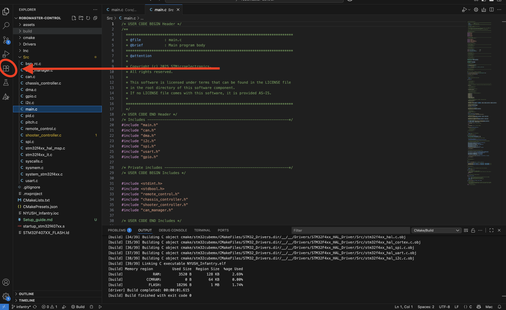

<p align="center"><sub><strong>Figure 1</strong>: extensions</sub></p>

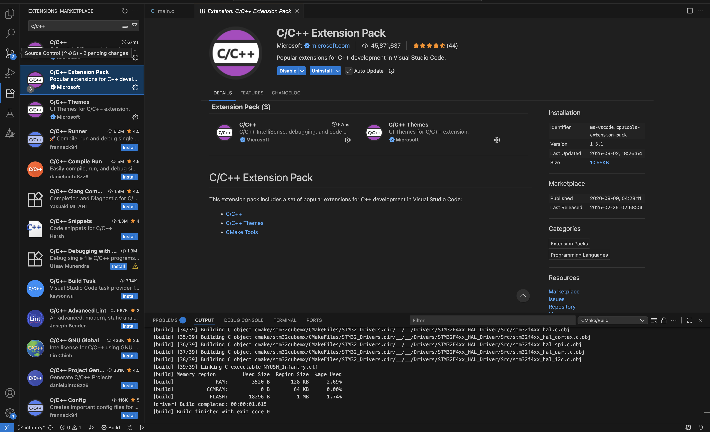

<p align="center"><sub><strong>Figure 2</strong>: c/c++</sub></p>

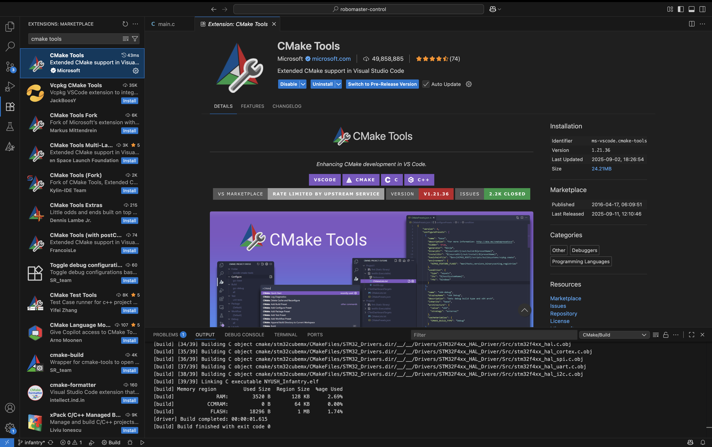

<p align="center"><sub><strong>Figure 3</strong>: CMake Tools</sub></p>

# Step 3: Cloning from GitLab 

**PLEASE NOTE THAT THE SETUP FOR THIS PART IS DIFFERENT FOR MAC AND WINDOWS, MAKE SURE TO FOLLOW YOUR SPECIFIC GUIDE**

## Mac Users

Run the following code within the terminal to install `Homebrew`

```bash
/bin/bash -c "$(curl -fsSL https://raw.githubusercontent.com/Homebrew/install/HEAD/install.sh)"
```

then run the following code to install `git` commands 

```bash
brew install git
```

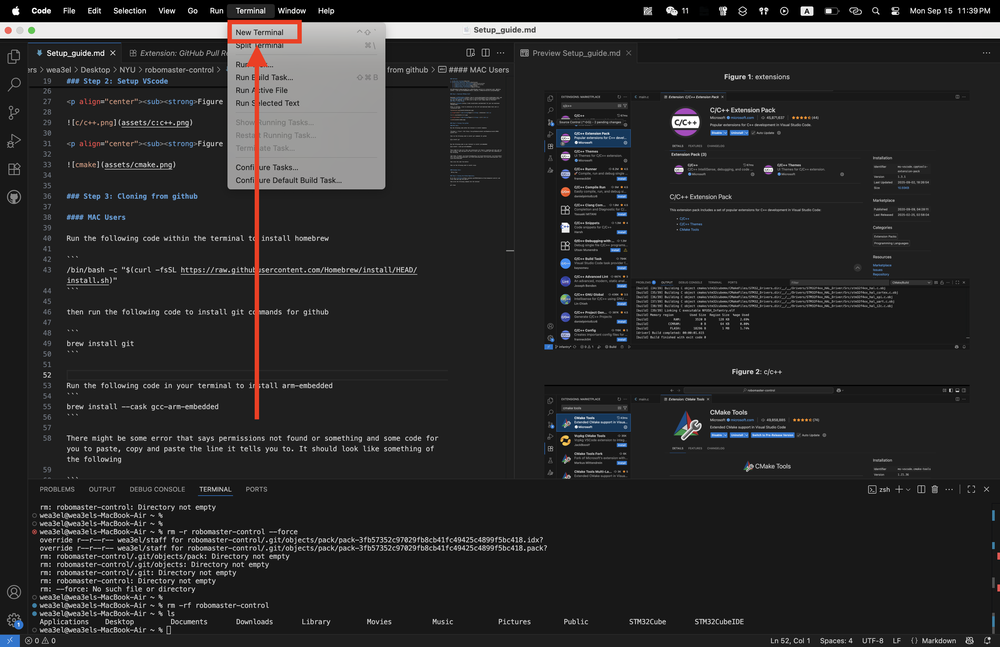

<p align="center"><sub><strong>Figure 4</strong>: opening the terminal</sub></p>

Then write the following commands into the terminal to generate an SSH key
```bash
ssh-keygen -t ed25519
ssh-add ~/.ssh/id_ed25519
cat ~/.ssh/id_ed25519.pub
```

Sign into GitLab, navigate to your account's [SSH keys](https://gitlab.com/-/user_settings/ssh_keys), click "Add new key", and paste the public key outputted above.

Write the following command into the terminal to clone the repository

```bash
git clone git@gitlab.com:nyu-robomaster/controls_freertos_pubsub.git
```

Follow the directions to clone the repository, if you cannot clone it, please contact one of the leads to invite you into the repository

After that, just open up VS Code and open the folder you have cloned and you should be able to see something similar to the following


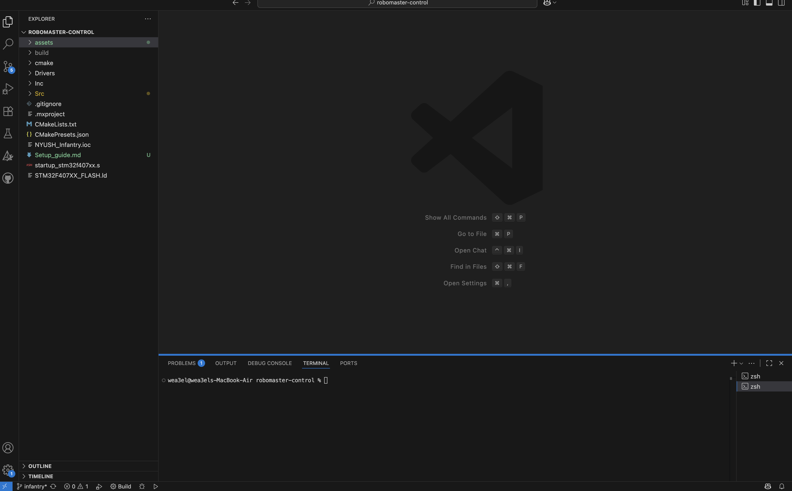

<p align="center"><sub><strong>Figure 5</strong>: code page</sub></p>

Click [**here**](github-commands.md) for more Git commands that we will be using


## Windows Users
Please download and install Git from the [official Git website](https://git-scm.com/downloads). During installation, you can accept the default settings.

Once installed, open a new terminal (like PowerShell or Git Bash) and run the following commands to generate an SSH key
```bash
ssh-keygen -t ed25519
ssh-add ~/.ssh/id_ed25519
cat ~/.ssh/id_ed25519.pub
```

Sign into GitLab, navigate to your account's [SSH keys](https://gitlab.com/-/user_settings/ssh_keys), click "Add new key", and paste the public key outputted above.

Run the following command in your terminal to clone the repository
```bash
git clone git@gitlab.com:nyu-robomaster/controls_freertos_pubsub.git
```

# Step 4: Installing Packages

**AGAIN THIS PART IS DIFFERENT FOR MAC AND WINDOWS**

## Mac Users
Run the following command in your terminal to install arm-embedded

```bash
brew install --cask gcc-arm-embedded
brew install ninja
brew install cmake
```

## Windows Users

First, download and install the following tools from their official websites:

- [**ARM GNU Toolchain**](https://developer.arm.com/downloads/-/arm-gnu-toolchain-downloads): Download the `arm-gnu-toolchain-14.3.rel1-mingw-w64-x86_64-arm-none-eabi.exe` installer and run it.

- [**CMake**](https://cmake.org/download/): Download and run the `.msi` installer. **Important:** During installation, ensure you select the option to "Add CMake to the system PATH for all users" or "for the current user". This is crucial for the build process.

Next, open PowerShell as an administrator and run the following command to install Ninja:
```powershell
winget install -e --id Ninja-build.Ninja
```


# Step 5: Building the Project

Go back to VS Code, click the search bar at the top and write

```text
>Developer: Reload Window
```

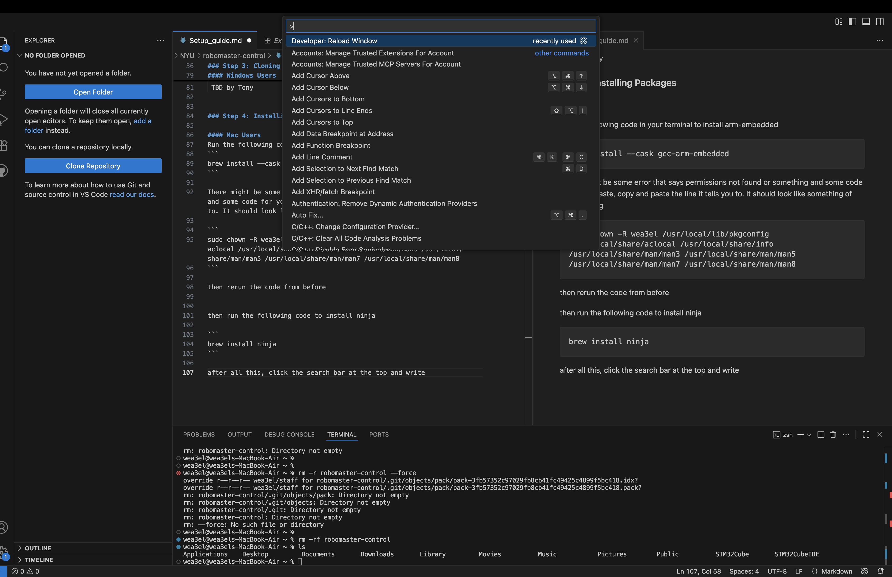


<p align="center"><sub><strong>Figure 6</strong>: Reload</sub></p>

and you should be able to see a little build button at the bottom


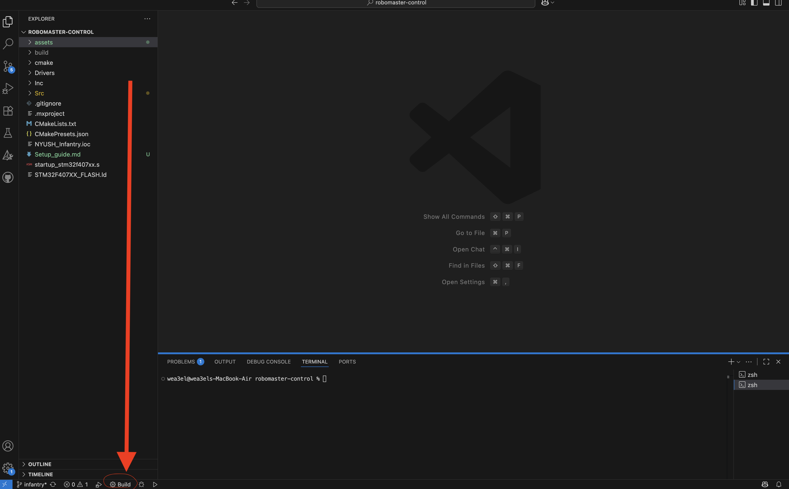

<p align="center"><sub><strong>Figure 7</strong>: Build</sub></p>

once you click the build button, just click the debug option and you should be allllll good

# Step 6: Flashing code onto the C Board

Take a RoboMaster C Board, and connect the C Board to your computer using a USB cable. 


<p align="center"><sub><strong>Figure 8</strong>: Connecting board to computer</sub></p>

Once you have connected the board, take a breadboard wire and insert it into the top two pins of boot and click the RST button on the right. 


<p align="center"><sub><strong>Figure 9</strong>: Switch to boot</sub></p>


<p align="center"><sub><strong>Figure 10</strong>: RST button</sub></p>

Open up STM32CubeProgrammer, at the top right, click ST-Link and change it to USB. 

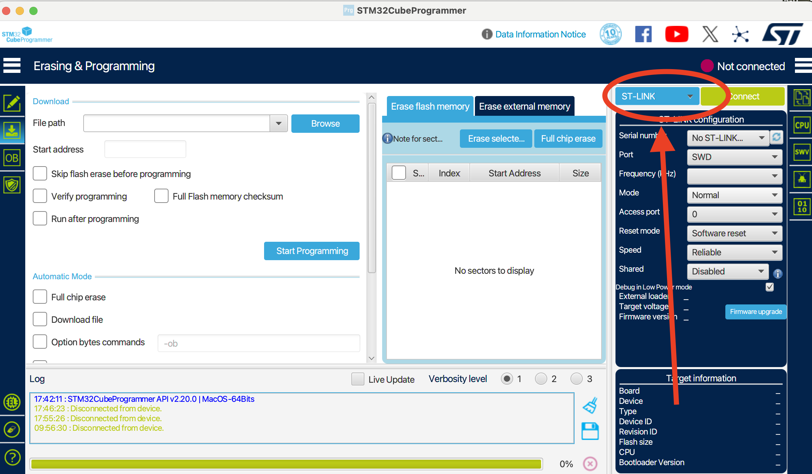

<p align="center"><sub><strong>Figure 11</strong>: Change to USB</sub></p>


Once you have done so, you should now see a USB1 there, if not, click the refresh button next to it. 

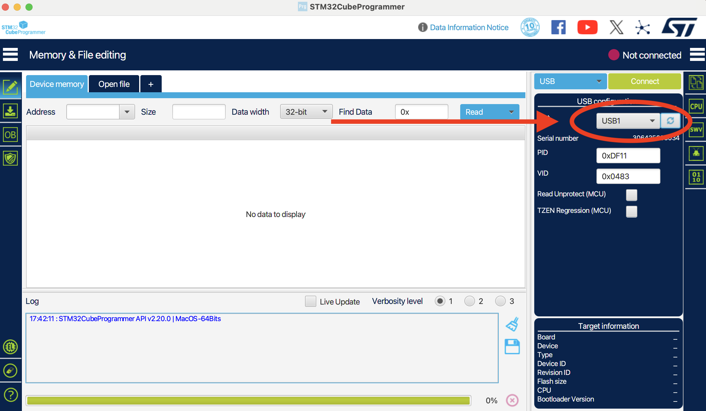

<p align="center"><sub><strong>Figure 12</strong>: USB1 Connect</sub></p>

After this, please click the erasing and programming button on the left, and switch the file to the `.elf` file that was generated in your `robomasters-control/build/Debug` folder (e.g., `NYUSH_Infantry.elf`).

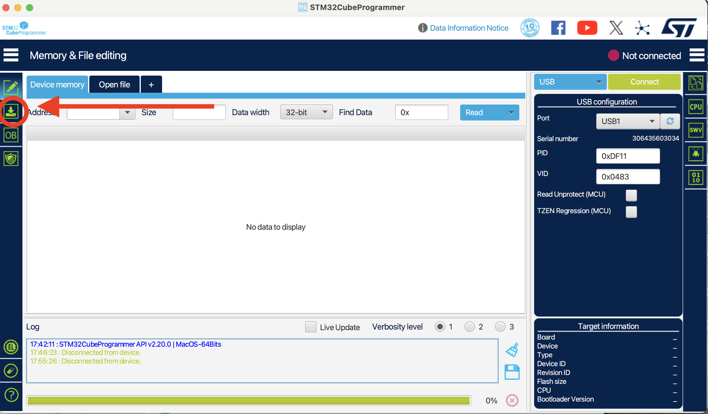

<p align="center"><sub><strong>Figure 13</strong>: Switch to erasure and programming</sub></p>

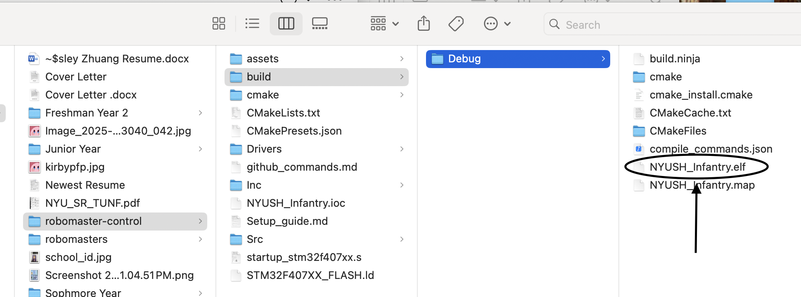

<p align="center"><sub><strong>Figure 14</strong>: Choose elf file</sub></p>


Click the connect light on the top right, the not connected sign will change from red to green and from not connected to connected

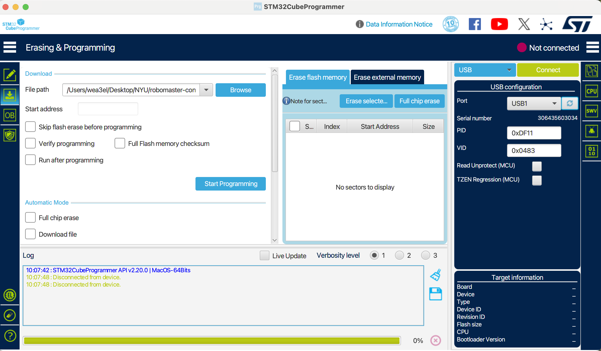

<p align="center"><sub><strong>Figure 15</strong>: Connect to the board</sub></p>

Finally, click programming, and you are all good! Congrats :D

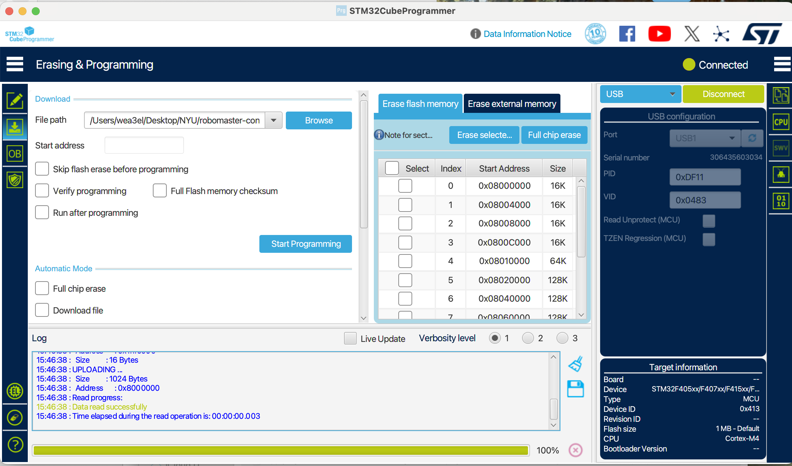

<p align="center"><sub><strong>Figure 16</strong>: Program to the board</sub></p>

# Step 7: Flashing with VSCode Tasks (Alternative Method)

If you prefer a more streamlined workflow without leaving VSCode, you can use VSCode tasks to build and flash your code automatically. This method offers two flashing options depending on your hardware setup.

## Prerequisites

Before using VSCode tasks for flashing, you need to install additional tools:

### Option 1: Using DFU-Util (USB Flashing)

**Mac Users:**
```bash
brew install dfu-util
```

**Windows Users:**
```powershell
winget install -e --id dfu-util.dfu-util
```

### Option 2: Using OpenOCD with ST-Link

**Mac Users:**
```bash
brew install openocd
```

**Windows Users:**
```powershell
winget install -e --id OpenOCD.OpenOCD
```

## Using VSCode Tasks

Once you have installed the required tools, you can use the following methods:

### Method 1: DFU-Util (Default Build Task)

This method flashes the board via USB using DFU mode.

1. Prepare the C Board: Connect the board and put it into DFU boot mode (same as Step 6 - use the boot wire and press RST)
2. In VSCode, press `Ctrl+Shift+B` (Windows/Linux) or `Cmd+Shift+B` (Mac) to run the default build task
3. This will automatically:
   - Build the project
   - Convert the `.elf` file to `.bin` format
   - Flash the `.bin` file to the board using dfu-util

Alternatively, you can:
1. Press `Ctrl+Shift+P` (Windows/Linux) or `Cmd+Shift+P` (Mac)
2. Type "Tasks: Run Task"
3. Select `flash: dfu-util`

### Method 2: OpenOCD with ST-Link

This method requires an ST-Link debugger connected to your board.

1. Connect your ST-Link debugger to the C Board
2. Press `Ctrl+Shift+P` (Windows/Linux) or `Cmd+Shift+P` (Mac)
3. Type "Tasks: Run Task"
4. Select `flash: openocd (stlink)`

This will automatically build and flash the project using OpenOCD.

## Available Tasks

The project includes the following VSCode tasks:

- `cmake: build` - Build the project only
- `pack: elf -> bin` - Convert ELF to BIN format (depends on build)
- `flash: dfu-util` - Flash via USB using DFU mode (default build task)
- `flash: openocd (stlink)` - Flash using ST-Link debugger

These tasks are configured in `.vscode/tasks.json` and can be customized if needed.
